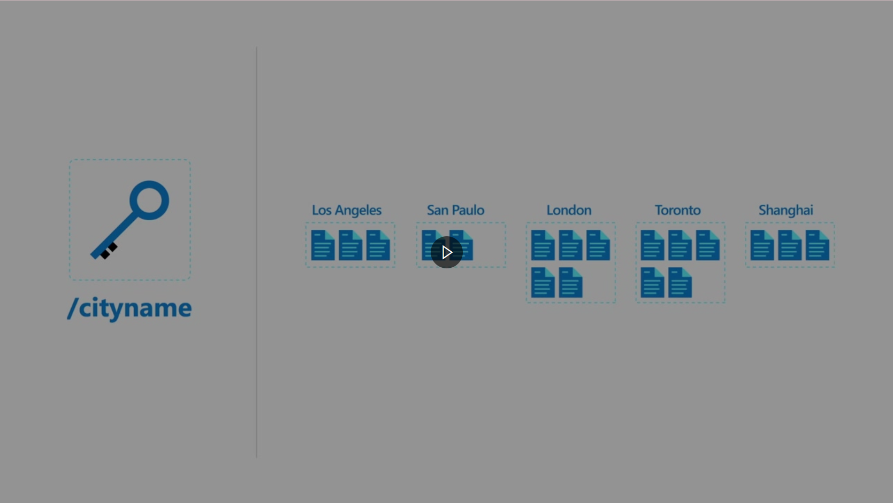

# Introduction to Azure Cosmos DB SQL API

Learn about the Azure Cosmos DB SQL API and determine if it is a good fit for your application.

<b>Learning objectives</b>

After completing this module, you’ll be able to:

* Evaluate whether Azure Cosmos DB SQL API is the right database for your application.
* Describe how the features of the Azure Cosmos DB SQL API are appropriate for modern applications.

<b>Prerequisites</b>

Before starting this module, you should have experience of building cloud applications with Microsoft C# or a similar programming language.

## Introduction

Today's apps deliver innovation in all facets of life. For a business to remain competitive, companies must build apps and products that work with real-time data, are resilient, and flexible.

Modern apps thrive on real-time data from different sources and shaped in different forms. An apps' usefulness is often in their ability to move and use data.

Developers require flexibility in their platforms so they can be responsive to business changes. Developers also require their entire application ecosystem to flexibly handle changes in the velocity, volume, or shape of their data. This flexibility enables developers to develop new features more rapidly than they ever have before.

## Scenario

Suppose you work as the lead developer at a retail company. Your team is building your online storefront. The new storefront will be designed to be accessible across various devices including mobile. The team expects a spike in demand when the storefront is published and various "grand opening" sales begin.

As the lead developer, you have been tasked with identifying a database platform. The database platforms you consider should be able to service the data your team will generate and collect over time. The selected database should also be able to handle a large variety of data, at high volumes and velocity. Your database solution needs to scale quickly and with little friction in order to handle this demand that is both growing and variable.

## Azure Cosmos DB

Azure Cosmos DB is a fast NoSQL database service for modern app development at any scale.

Developers require new kinds of databases that can address the needs of modern apps. NoSQL databases were designed to address these needs and unique challenges such as:

* High volumes of data
* Data with many different sources and forms
* Dynamic data schemas to store different types of data
* Using high-velocity and/or real-time data

NoSQL databases are defined by common characteristics they share rather than a specific formal definition. These characteristics include:

* Data store is non-relational
* Designed for scale-out
* Does not enforce a specific schema

NoSQL databases generally do not enforce relational constraints or put locks on data, making writes fast. They are also often designed for horizontally scale via sharding or partitioning, which allows them to maintain high-performance regardless of size.

While there are many NoSQL data models, four broad data model families are commonly used when modeling data in a NoSQL database:


Moving forward, we will focus on the document data model, the data model supported by Azure Cosmos DB SQL API

---

# What is Azure Cosmos DB SQL API

Let's start with a few definitions and a quick tour through Azure Cosmos DB SQL API. This overview should help you see whether Azure Cosmos DB might be a good fit for your work.

## What is a NoSQL database?

Here, you'll see how Azure Cosmos DB and its SQL API can be used for this type of business problem. You'll also learn a bit about how the database works. At the end, this module will help you decide if Azure Cosmos DB's SQL API is a good choice for your solutions.

## Why use a NoSQL database with the document data model?

The document data model breaks data down into individual document entities. A document can be any structured data type, but JSON is commonly used as the data format. The Azure Cosmos DB SQL API supports JSON natively.


A document is an atomic entity and can have its own data form, regardless of what is stored in other documents in the same database. Because of this flexibility, there is no need for a pre-defined schema making it easier to build new applications rapidly. Additionally, this flexibility enables scenarios where different types of data can be stored together and where models can evolve over the lifetime of an application.

## What is a JSON document?

JavaScript Object Notation, or [JSON](https://www.json.org/json-en.html), is a lightweight data format. JSON was built to be highly compatible with the literal notation of an object in the JavaScript language. Many frameworks, browsers, and even databases support JavaScript natively making JSON a popular format for transmitting and storing data.

Here is an example of a JSON document:

```JSON
{
  "device": {
    "type": "mobile"
  },
  "sentTime": "2019-11-12T13:08:42",
  "spoolRefs": [
    "6a86682c-be5a-4a4a-bacd-96c4d1c7ece6",
    "79e78fe2-93aa-4688-89db-a7278b034aa6"
  ]
}
```

As you can see, JSON is a relatively readable data format that clearly exposes its content. JSON is also relatively easy to parse and use in JavaScript applications.

## What is Azure Cosmos DB SQL API?

Azure Cosmos DB SQL API is a fast NoSQL database service that offers rich querying over diverse data, helps deliver configurable and reliable performance, is globally distributed, and enables rapid development.


The SQL API is the core or native API for working with documents. The SQL API supports fast, flexible development utilizing JSON documents, a query language with a familiar syntax, and client libraries for popular programming languages. Azure Cosmos DB provides other APIs, such as Mongo, Gremlin, and Cassandra, that offer compatibility with each database ecosystem while still mapping to the same underlying infrastructure of the native SQL API.

Azure Cosmos DB SQL API has a few advantages such as:

* **Guaranteed speed at any scale** — even through bursts—with instant, limitless elasticity, fast reads, and multi-master writes, anywhere in the world
* **Fast, flexible app development** with SDKs for popular languages, a native SQL API along with APIs for MongoDB, Cassandra, and Gremlin, and no-ETL (extract, transform, load) analytics
* **Ready for mission-critical applications** with guaranteed business continuity, 99.999-percent availability, and enterprise-grade security
* **Fully managed and cost-effective serverless database** with instant, automatic scaling that responds to application needs

These capabilities make Azure Cosmos DB ideally suited for modern application development. Azure Cosmos DB SQL API is especially suited for applications that:

* Experience unpredictable spikes and dips in traffic
* Generate lots of data
* Need to deliver real-time user experiences
* Are depended upon for business continuity

The Azure Cosmos DB SQL API can arbitrarily store native JSON documents with flexible schema. Data is indexed automatically and is available for query using a flavor of the SQL query language designed for JSON data. The SQL API can be accessed using SDKs for popular frameworks such as [.NET](https://docs.microsoft.com/en-us/azure/cosmos-db/sql/sql-api-sdk-dotnet-standard), [Python](https://docs.microsoft.com/en-us/azure/cosmos-db/sql/sql-api-sdk-python), [Java](https://docs.microsoft.com/en-us/azure/cosmos-db/sql/sql-api-sdk-java-v4), and [Node.js](https://docs.microsoft.com/en-us/azure/cosmos-db/sql/sql-api-sdk-node).

---

# How does Azure Cosmos DB SQL API work

Now that we know the basics of Azure Cosmos DB, let's see what resources and information is required to start working with an account. This information should help you decide whether Azure Cosmos DB SQL API will work for your data set and how much, if any, extra configuration is necessary.

## What are the components of Azure Cosmos DB SQL API?

To begin using Azure Cosmos DB, you will need to create various resources in Azure such as accounts, databases, containers, and items.


### Accounts

**Accounts** are the fundamental units of distribution and high availability. At the account level, you can configure the region[s] for your data in Azure Cosmos DB SQL API. Accounts also contain the globally unique DNS name used for API requests. You can also set the default consistency level for requests at the account. You can manage or create accounts using the Azure portal, Azure Resource Manager templates, the Azure CLI, or Azure PowerShell.

### Databases

Each account can contain one or more **Databases**. A database is a logical unit of management for containers in Azure Cosmos DB SQL API.

### Containers

**Containers** are the fundamental unit of scalability in Azure Cosmos DB SQL API. With Azure Cosmos DB, you provision throughput at the container level. You can also optionally configure an indexing policy or a default time-to-live value at the container level. Azure Cosmos DB SQL API will automatically and transparently partition the data in a container.

### Items

The SQL API for Azure Cosmos DB stores individual documents in JSON format as *items* within the container. Azure Cosmos DB SQL API natively supports JSON files and can provide fast and predictable performance because write operations on JSON documents are atomic.


### Partitioning & Partition Keys

[](https://www.microsoft.com/en-us/videoplayer/embed/RE4OAlA?postJsllMsg=true)

Every Azure Cosmos DB SQL API container is required to specify a **partition key path**. Behind the scenes, Azure Cosmos DB SQL API uses this path to logically partition data using **partition key values**. For example, consider the following JSON document:

```JSON
{
  "id": "35b5bf7d-5f0e-4209-b7cb-8c5c70c3bb59",
  "deviceDisplayName": "shared-printer",
  "acquiredYear": 2019,
  "department": {
    "name": "information-technology",
    "metadata": {
      "location": "floor-5-unit-27"
    }
  },
  "queuedDocuments": [
    {
      "sender": "user-293749329",
      "sentTime": "2019-07-26T05:12:37",
      "pages": 5,
      "spoolRef": "3f4b759c-3230-4269-a88e-de7620ad91c0"
    },
    {
      "device": {
        "type": "mobile"
      },
      "sentTime": "2019-11-12T13:08:42",
      "spoolRefs": [
        "6a86682c-be5a-4a4a-bacd-96c4d1c7ece6",
        "79e78fe2-93aa-4688-89db-a7278b034aa6"
      ]
    }
  ]
}
```

If your container specifies a partition key **path** of `/department/name`, then the partition **key** value of this document would be `information-technology`. Behind the scenes, Azure Cosmos DB SQL API automatically manages the physical resources necessary to support your data workload.

Selecting a partition key path for a container can be one of the most important design decisions for a new workload. Review the choosing a [partition key documentation](https://docs.microsoft.com/en-us/azure/cosmos-db/partitioning-overview#choose-partitionkey) for a deeper technical explanation and best practices.

---

# When should you use Azure Cosmos DB SQL API

Azure Cosmos DB SQL API is a fully managed NoSQL database service for modern app development that provides guaranteed single-digit millisecond response times and 99.999-percent availability, backed by SLAs with automatic and instant scalability.

For enterprise scenarios, Azure Cosmos DB SQL API has a comprehensive suite of financially backed [service level agreements](https://azure.microsoft.com/en-us/support/legal/sla/cosmos-db/v1_4/) (SLAs) that cover throughput, consistency, availability, and latency.

## Common use cases for the Azure Cosmos DB SQL API

As a fast NoSQL database with a flexible API, Azure Cosmos DB SQL API is well suited for high-performance applications with global ambition. Speed and flexibility makes Azure Cosmos DB SQL API great for web, retail, IoT, gaming, and mobile applications that require flexibility, low response time, and transactions at massive volume or velocity.

### IoT/telemetry

IoT sensor workloads can be diverse and unpredictable. These workloads require a database platform that is responsive and capable of elastic scale to meet the needs of as many, or as few, data collection devices deployed at any point in time. In many cases, IoT workloads can also write massive volumes of data and would benefit from a write-optimized database platform. Azure Cosmos DB SQL API is optimized for write-heavy workloads. Operations on a single document are atomic with fast and predictable indexed write speeds. Azure Cosmos DB SQL API is also globally distributed and elastic to meet the needs of various IoT workloads.


In this example, a growing number of IoT devices are sending sensor data to an Azure IoT Hub. Azure Databricks then ingests and aggregates the data for storage in Azure Cosmos DB SQL API. Azure Synapse Analytics then performs near real-time analysis over the data using [Azure Synapse Link for Azure Cosmos DB](https://docs.microsoft.com/en-us/azure/cosmos-db/synapse-link).

### Retail/marketing

Azure Cosmos DB SQL API is a great fit for retail and marketing workloads that can experience dramatic and unexpected swings in usage at any point throughout the year. The elastic scale of Azure Cosmos DB SQL API ensures that the database platform can handle requests during peak usage, and save money during non-peak times.


In this example, a JavaScript web application, built on content stored in Azure Blob Storage, uses Azure Cosmos DB SQL API as it's backing database. Multiple accounts are used to manage different facets of the solution such as the shopping cart, inventory, or catalog. Azure Cosmos DB SQL API data is then indexed by Azure Search to provide a rich search experience to end users.

### Web/mobile

Many modern social applications generate a plethora of user-generated content that is diverse in quantity, shape, and volume. Azure Cosmos DB SQL API is a great candidate for this workload as this API can store data of varying schemas. Consider the SQL API for data that may have schemas that change or evolve over time as the company's initiatives expand into new areas.


In this example, a user is using a URL to access a web site in their browser. The URL points to Azure Traffic Manager, which then uses a built-in algorithm to determine which Azure App Service endpoint to redirect the user to. Since Azure Cosmos DB SQL API is capable of global distribution, you only need one account that is replicated across multiple regions.

## Module Scenario

Consider the scenario from the beginning of this module:

> Suppose you work as the lead developer at a retail company. Your team is building your online storefront. The new storefront will be designed to be accessible across various devices including mobile. The team expects a spike in demand when the storefront is published and various "grand opening" sales begin.

One key part of your store's success is the ability for company to notify users of shipping updates regardless of what device they place the order on or are currently using. Your team has worked hard on a sophisticated system to manage detailed order status tracking. With Azure Cosmos DB's tight integration with other Azure services, you can consider building solutions that use order data in Azure Cosmos DB SQL API to send notification to your user's mobile devices when their package ships, or is out for delivery.

![Architectural diagram for a retail workload showing a growing number of users ordering products and a collection of compute resources handling requests from the storefront instances. Behind the compute resources, Azure Cosmos DB stores purchase data. Then, Azure Synapse Link connects Azure Cosmos DB to Azure Synapse Analytics for deeper analytics. Finally, Azure Functions, triggered off of change feed, processing data events that then trigger an Azure Logic Apps workflow to perform business operations such as notifying the user on their mobile device of new events.](https://docs.microsoft.com/en-us/learn/wwl-data-ai/introduction-to-azure-cosmos-db-sql-api/media/4-retail-scenario.png)

This example is similar to the example from the introduction of this module. To build on the first example, your team has decided to introduce Azure Cosmos DB SQL API as the database of choice. Now, your team can use Azure Synapse Link to prepare and aggregate data for deeper analysis using Azure Synapse Analytics. Your team can also use services such as Azure Functions to react to data events with Azure Cosmos DB, and then trigger an Azure Logic Apps workflow that will send notifications to mobile devices.

---

# Summary

In this module, you have learned how Azure Cosmos DB SQL API will allow you to get a database launched with relatively little friction and will grow with your company as your needs evolve.

Azure Cosmos DB SQL API eases many common pain points by offering an elastic and globally distributed database platform. Azure Cosmos DB SQL API will scale up-and-down to meet your real-world usage. The SQL API for Azure Cosmos DB SQL API is the built-in native API with the widest variety of SDK options for developers in your organization. The SQL API also natively uses JSON documents enabling your team to store a wide variety of data formats in your database.

Now that you have completed this module, you can:

* Evaluate whether Azure Cosmos DB SQL API is the right database for your application.
* Describe how the features of the Azure Cosmos DB SQL API are appropriate for modern applications.